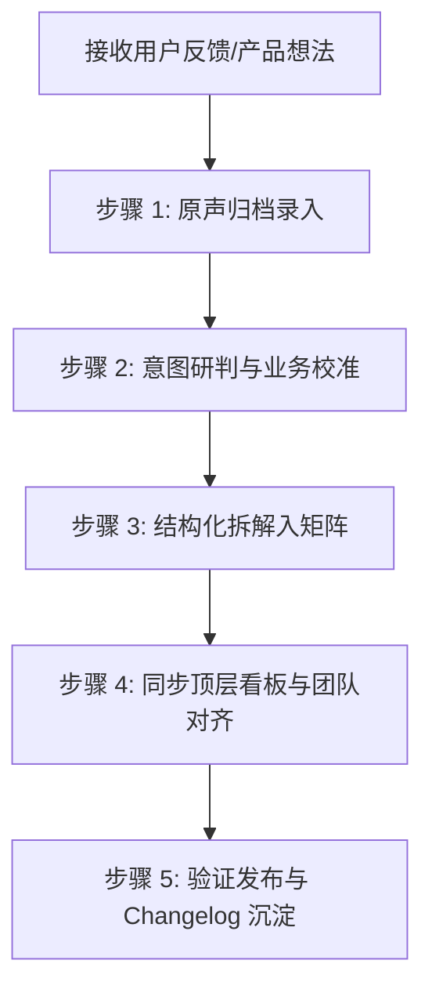

# 客户需求记录与待办拆解技能 (Customer Feedback to TODO Skill)

本技能定义了如何将**用户、客户、共修学友的原始口语反馈或零散想法**，转化为工程级、可落地的结构化任务规范，并维护在项目根目录的 `todo.md` 中。

核心铁律：**“原声归档，研判拆解；先立待办，而后成章。”**（严禁在未记录拆解前直接盲目动工开发）。

---

## 核心价值与三层金字塔架构

用户原话往往是**感性的、口语化的、场景化的**，甚至伴随概念口误或跳跃性联想；而工程研发需要**模块边界清晰、数据模型确立、前后端权责明确、带量化验收标准**。更重要的是，在持续迭代中，项目必须保证**已完成 vs 待开发 一目了然**，绝不允许任务状态混沌。

因此，处理任何用户反馈时，必须在 `todo.md` 中维系三层清晰架构：
1. **第零层：全局状态看板 (Status Dashboard · 顶置总览)**：
   - 在文档最顶端维护全局状态看板，分为三张清晰清单：
     - ① **原声状态对照表**（编号、提出人、概要、关联任务、状态、交付版本）；
     - ② **待开发任务清单**（本次规划待做的任务，带 P0/P1、端职责、状态 ⏳ 待开发）；
     - ③ **已完成交付清单**（往期已验证上线的任务，标注版本与 🟢 已实现）。
   - **铁律**：严禁仅在长文内部打勾，顶层看板必须实时同步，确保任何人打开文档 3 秒内分清“哪些做完了、哪些还没做”。
2. **第一层：用户原声归档池 (VOC Archive)**：原汁原味留存用户原话、反馈人、时间、场景背景及实物截图附件。
3. **第二层：结构化待办与交付矩阵 (Actionable Matrices)**：
   - 物理隔离为两大部分：
     - **《三、本期待开发实施矩阵 (Pending Tasks)》**：仅放当前版本待做任务（标记为 `[ ]`）；
     - **《四、往期已上线交付矩阵 (Completed & Shipped)》**：历史版本已交付任务全量归档于此（标记为 `[x]`）。

---

## 五步标准化作业流程 (SOP)



### 步骤 1：原声归档录入 (Voice of Customer Archive)
- **编号生成**：按 `#VOC-YYYYMMDD-序号` 编制唯一编号（例：`#VOC-20260904-01`）。
- **保留原貌**：如实抄录用户原始对话，不擅自“技术化美化”。
- **附图与多媒体处理**：如果用户提供了图片、卡牌、原型涂鸦：
  1. 将图片复制持久化到项目的 `docs/assets/` 目录下（如 `docs/assets/feature_sample.jpg`）；
  2. 在 `todo.md` 中使用相对路径或 markdown 链接引用该图。

### 步骤 2：意图研判与业务校准 (Intent Analysis & Clarification)
执行**意图研判四问法**：
1. **真实痛点**：用户在什么场景下遇到了什么不便？（例如：读经被弹窗打扰、抽到签文不知出处）。
2. **本质诉求**：用户期望的交互体验和心理预期是什么？（例如：翻书般的沉浸感、像朋友圈一样的互动感）。
3. **概念辨析与纠偏**：原话中是否存在口误或混淆？
   - *案例*：反馈说“1.7是天山遁”，实际是论语原典章节编码 `1.7`（《学而》第7章），而非周易卦序。必须在研判中进行技术纠偏，避免南辕北辙。
4. **技术可行性**：涉及客户端界面（Flutter）、服务端（Rust Axum）、数据库（SQLite）还是静态数据资产？

### 步骤 3：结构化拆解入矩阵 (Decompose to Actionable Tasks)
每个任务必须遵循以下模板规范，并录入对应功能模块下：
- **任务编号**：`[TASK-模块代号-序号]`（如 `[TASK-CLASSIC-01]`、`[TASK-DIVINE-02]`）。
- **优先级**：
  - `P0`：阻塞体验、核心阅读/研习主链路、高频主干功能。
  - `P1`：重要交互闭环、社群协同、社交流转。
  - `P2`：进阶动效、拓展视觉拟物、离线增强。
- **职责端**：明确标注 `Flutter 前端` / `Rust 后端` / `数据层`。
- **具体实施要求**：清单化列出要新增/修改的文件、数据表字段、API 路由或 UI 交互逻辑。
- **验收标准**：定义明确、可验证、客观的 Done 标准。

### 步骤 4：同步顶层看板与团队确认 (Status Lifecycle & Dashboard Sync)
- **顶层看板联动更新（必做）**：
  - 新录入待办时：立即在顶层《待开发任务清单》增补条目，并标记为 `⏳ 待开发`；
  - 开始实施时：标为 `[-] 进行中`；
  - 交付完成时：从《待开发任务清单》移入《已完成交付清单》，并在《往期已上线交付矩阵》归档为 `[x]`；
- **任务生命周期状态**：
  - `[ ]`：待开发规划（TODO）
  - `[-]`：开发推进中（IN PROGRESS）
  - `[x]`：已完成且已验证（DONE）
  - `[BLOCKED]`：存在前置阻塞，需明确写出阻碍原因

### 步骤 4.5：动工前门禁 · 触发 /gh-driven-workflow（刚性铁律）
- 严禁在只有 `#VOC-XX` 编号而没有 GitHub Issue 的情况下开始编写任何代码！
- 任何待办任务从 `⏳ 待开发` 变为实施前，**必须调用 `gh issue create` 创建正式 GitHub Issue** 并获取 `#ID`；
- 在 `changelog.md` 预登记该 `#ID`；
- 每次 Git 提交必须以 `#ID` 结尾；
- 验证完毕后通过 `gh issue close <#ID>` 规范闭环。

### 步骤 5：发布闭环与文档反哺
- 当模块任务全部勾选 `[x]` 并通过端到端测试后：
  1. 将完成的任务沉淀至 `todo.md` 的《四、往期已上线交付矩阵》中，同步点亮顶部看板为 🟢 **已实现**；
  2. 同步更新对外发布的 `changelog.md`，记录版本演进日志与对应 GitHub Issue 编号及 VOC 编号；
  3. 通过 `gh issue close` 彻底关闭对应 GitHub Issue；
  4. 若在实践中提炼出新的流程经验或反模式，必须反哺回本技能文档（`SKILL.md`）。

---

## 待办拆解参考模板 (Templates)

### 1. 原声归档条目模板
```markdown
### 反馈编号 #VOC-YYYYMMDD-XX：[简明主题名]
- **反馈时间**：YYYY-MM-DD
- **反馈来源**：[用户姓名/渠道/社群角色]
- **附带实物/参考图**：[图片链接/路径]（若有）
- **用户原话**：
  > “[一字不差的用户原始对话或留言]”
- **深度意图研判与对齐**：
  - **痛点分析**：……
  - **核心诉求**：……
  - **概念校准**：……
- **关联待办**：[TASK-XXX-01]、[TASK-XXX-02]
```

### 2. 结构化待办条目模板
```markdown
- [ ] **[TASK-XXX-01] [任务名称简述] (P0/P1/P2)**
  - **端**：Flutter 前端 / Rust 后端 / 数据层
  - **对应原声**：#VOC-YYYYMMDD-XX
  - **具体要求**：
    1. ……
    2. ……
  - **验收标准**：……
```

---

## 典型示例 (Case Studies)

### 示例 A：口语化描述拆解为具体交互
- **原话**：“那个易经这一版面第一进去的，就像咱们翻开书一样，最干净的原典原文，练习这一块主要针对初学者。”
- **拆解**：
  - `[TASK-CLASSIC-01] 经典首屏“纯净翻书”视图设计 (P0)`：移除非必要悬浮练习按钮，保留原典、断句排版，默认沉浸阅读。
  - `[TASK-CLASSIC-02] “初学研习练”模块解耦与轻量引导 (P1)`：背诵卡、填空题收拢为底部轻量抽屉。

### 示例 B：实物参照拆解为数字拟物
- **原话**：“周易64卦的签筒，就是卦名加上大象传。那个卦的扑克牌你见过没有” + 实物照片。
- **拆解**：
  - 保存实物照片至 `docs/assets/hexagram_card_sample.jpg`。
  - `[TASK-DIVINE-02] 周易六十四卦拟物扑克卡牌UI (P0)`：对角双扑克角标、金青双色六爻画、大字卦名、上下卦物象解、大象传箴言。

---

## 自动化辅助指令建议

当收到用户新的需求或反馈时，智能体应自主：
1. 自动读取现有 `todo.md`，检查末尾编号并递增；
2. 执行原声写入与意图研判；
3. 将拆解任务归入对应模块，若无匹配模块则新建二级模块；
4. 向用户输出研判对比摘要，请求确认关键设计决策。
