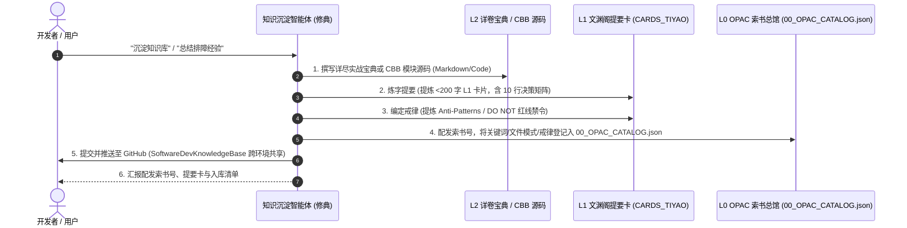

# 软件工程四库三藏知识沉淀与修典规范 (Siku Knowledge Distillation Skill)

本技能融合**《四库全书》（经、史、子、集）**、**佛家三藏（经立宗/律戒坑/论穷理）**与**现代图书馆学索书号（Call Number）与文渊阁提要卡（L1 Card）**体系，实现工程经验与 CBB 公共资产的标准化萃取。

---

## 🏛️ 四库部类与资产定级标准

每一次知识沉淀必须完成 **L2 全文 ➔ L1 提要卡 ➔ L0 OPAC 目录** 三级资产闭环：

| 部类 | 类别标识 | 涵盖范畴 | 输出文件规范 |
| :--- | :--- | :--- | :--- |
| **📜 经部 (Jing)** | `JING-*` | 顶层架构规范、元规则公理、安全与鉴权铁律 | `docs/architecture/*.md` + `docs/CARDS_TIYAO/JING-*.card.md` |
| **📖 史部 (Shi)** | `SHI-*` | 实战排障实录、重大 Bug 根因复盘、物理抓包取证 | `docs/deployment/*.md` 或 `docs/troubleshooting/*.md` + 提要卡 |
| **🧩 子部 (Zi)** | `ZI-*` | CBB 通用公共构建块、算法引擎、中间件脚手架 | `cbb/<tech-stack>/<name>/` + 提要卡 |
| **🚢 集部 (Ji)** | `JI-*` | 综合解决方案、混合云架构宝典、版本交付总案 | `docs/deployment/*_RECIPE.md` + 提要卡 |

---

## 🏷️ 索书号 (Call Number) 命名规范

$$\text{索书号} = \mathbf{[部类Prefix]}-\mathbf{[领域].[子类]}/\mathbf{[模块名]}-\mathbf{[流水号]}$$

- 示例：`SHI-NET.02/ECS-BEAVER-01`（史部-网络.02/阿里云Beaver拦截案）
- 示例：`ZI-WECHAT.01/WECOM-RELAY-01`（子部-企微.01/企微中继CBB）
- 示例：`JING-DB.01/SQLITE-POOL-01`（经部-数据库.01/SQLite连接池单例）

---

## 🚀 修典成书四步作业法 (Distillation Protocol)

### 1. 撰写 L2 详卷宝典或 CBB 模块
- 全局中央知识库路径：`/Users/jasonxiao/Projects/SoftwareDevKnowledgeBase/`（或 `$HOME/Projects/SoftwareDevKnowledgeBase`）。
- 架构宝典入 `01-Architecture-And-Design/`，安全入 `05-Security-And-Compliance/`，CBB 入 `cbb/<stack>/<name>/`。
- 必须包含真实生产环境现场日志、Mermaid 拓扑图与根因分析。

### 2. 提炼 L1 文渊阁提要卡 (`/Users/jasonxiao/Projects/SoftwareDevKnowledgeBase/docs/CARDS_TIYAO/<CALL_NUM>.card.md`)
- 严格控制在 **200 字 / 200 tokens 以内**。
- 包含：**10 行决策矩阵 / 3 步极速配置** + **⛔ 戒律红线 (Vinaya / Anti-Patterns)**。

### 3. 登记 L0 OPAC 索书总馆 (`/Users/jasonxiao/Projects/SoftwareDevKnowledgeBase/docs/00_OPAC_CATALOG.json`)
- 将索书号、部类、标题、触发关键词（`triggers`）、关联文件模式（`file_patterns`）、提要卡路径（`card_path`）与戒律清单（`taboos`）追加到 JSON 索引中。

### 4. 提交并同步至 GitHub 远程共享
- 完成入库与索书目录登记后，调用 `/kb-push`（或在 `SoftwareDevKnowledgeBase` 执行 `git add . && git commit -m "..." && git push origin main`）。
- 确保最新沉淀的 CBB 与架构/排障经验实时推送到 `https://github.com/JasonCry/SoftwareDevKnowledgeBase`，让所有开发环境无缝共享。

---

## 💎 质量与验收铁律

1. **真实战检验**：拒绝虚构/未验证方案，所有沉淀必须经过真实联调与验证。
2. **提要为道日损**：L1 卡片必须精炼至极，严禁冗长叙述，确保 AI 消费时上下文零膨胀。
3. **必立戒律红线**：每次踩坑必须提取至少 1 条明确的 Anti-Pattern 禁令。
