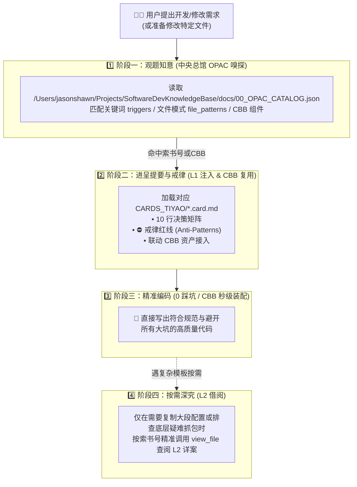

# 知识库司书侍读与渐进式上下文加载规范 (Knowledge Navigator Skill)

本技能充当 AI 软件研发过程中的**“随身司书侍读官”**，基于现代图书馆学索书号与文渊阁提要卡体系，实现**“零全量搜索、零上下文膨胀、精准前置避坑、渐进按需调阅”**。

---

## 🎯 核心价值：为什么不要全量搜索？

| 传统模式（全局盲搜） | 司书侍读模式（渐进式加载） |
| :--- | :--- |
| ❌ 每次任务都执行 `grep/find` 扫全库 | ✅ 仅读取轻量 `00_OPAC_CATALOG.json`（几百字节）秒级匹配 |
| ❌ 一次性把万字大文档塞入 Prompt 挤占上下文 | ✅ 仅注入 **~200 tokens 的 L1 文渊阁提要卡与戒律红线** |
| ❌ 遗漏既往踩坑教训，重复犯错 | ✅ 根据当前修改的文件与关键词，**前置自动唤醒戒律** |

---

## 🏛️ 知识馆藏双轨拓扑与寻址规范 (Repository Topology)

为确保在**任何工程、任何子目录或新建项目**中均能无缝调阅知识资产，司书侍读统一采用以下绝对寻址拓扑：

1. **🏛️ 中央知识总馆 (Global Central Hub - 必须优先调阅)**：
   - **索书总目录 (L0 OPAC)**：`/Users/jasonshawn/Projects/SoftwareDevKnowledgeBase/docs/00_OPAC_CATALOG.json`
   - **文渊阁提要卡 (L1 Cards)**：`/Users/jasonshawn/Projects/SoftwareDevKnowledgeBase/docs/CARDS_TIYAO/`
   - **CBB 通用组件库 (CBB Assets)**：`/Users/jasonshawn/Projects/SoftwareDevKnowledgeBase/cbb/`
2. **📂 工程本地分馆 (Local Project Repo - 增量融合)**：
   - 若当前工程根目录下存在 `docs/00_OPAC_CATALOG.json`，则与中央总馆目录合并检索。

---

## 🧭 三阶段渐进式加载协议 (3-Tier Protocol)

---

## 📋 司书侍读作业标准流 (SOP)

### 步骤 1：意图与文件嗅探 (Sense Intent)
在开始编写代码、设计方案或修改已有文件前：
1. **调阅中央总目录**：使用 `view_file` 读取 `/Users/jasonshawn/Projects/SoftwareDevKnowledgeBase/docs/00_OPAC_CATALOG.json`；
2. **对比命中项**：将用户 Prompt 关键词与涉及的文件路径匹配 `triggers`、`file_patterns` 及 `cbb/` 目录；
3. **严禁盲目放弃**：**绝不能因为当前工作区（如 WuDangShuYuan）本地没有 docs 目录就放弃调阅**，中央总馆永远在线！

### 步骤 2：提取 L1 文渊阁提要卡与 CBB 契约 (Load L1 Card & CBB)
若命中索书号或通用业务能力（如登录鉴权、微信扫码、数据库高并发、临摹画板等）：
- 使用 `view_file` **仅读取对应的 `.card.md` 文件**（约 15~20 行）；
- 若命中 CBB 资产，优先调阅 `/Users/jasonshawn/Projects/SoftwareDevKnowledgeBase/cbb/<tech>/<name>/README.md` 中的接口契约；
- 牢记其中的 **⛔ 戒律红线 (Taboos / Anti-Patterns)** 与 **💡 决策矩阵**。

### 步骤 3：知止不殆，按需借阅 (On-Demand L2)
- **90% 场景**：仅凭 L1 提要卡中的铁律与 CBB 契约即可保证 100% 避坑并顺利交付。
- **10% 场景**：仅当需要完整复制大型配置文件模板（如完整的 Nginx 配置、复杂的 FRP 配置、Python 发信脚本）或审查底层抓包报文时，才调阅 `deep_doc_path`。

---

## 🏷️ 常用索书号快速索引表

| 索书号 | 部类与主题 | 核心戒律摘要 | 提要卡路径 |
| :--- | :--- | :--- | :--- |
| `SHI-NET.02/ECS-BEAVER-01` | 史部 / 阿里云 ECS 企微对接 | 企微必须用公网 IP + 80 端口，严禁填非标端口与未备案域名，证书 chmod 644 | `docs/CARDS_TIYAO/SHI-NET.02-ECS-BEAVER.card.md` |
| `SHI-NET.01/CF-ECH-RST-01` | 史部 / Cloudflare 移动端阻断 | 严禁在面向国内移动端的域名开启 ECH 与纯 HTTP/3 | `docs/CARDS_TIYAO/SHI-NET.01-CF-ECH.card.md` |
| `JING-DB.01/SQLITE-POOL-01` | 经部 / SQLite 高并发连接池 | 必须使用 `Storage::global()` 全局单例，严禁频繁 new()，权限 0644 | `docs/CARDS_TIYAO/JING-DB.01-SQLITE-CONCURRENCY.card.md` |
| `JING-ARCH.01/MULTI-TENANT-01` | 经部 / 多租户物理数据隔离 | 每个用户独立目录与独立数据库，严禁跨租户读写 | `docs/CARDS_TIYAO/JING-ARCH.01-MULTI-TENANT.card.md` |
| `ZI-WECHAT.01/WECOM-RELAY-01` | 子部 / 企微加解密与双轨中继 | 必须 MsgId 去重，超时 4.5s 必须先回 200 再异步主动推送 | `docs/CARDS_TIYAO/ZI-WECHAT.01-WECOM-RELAY.card.md` |
