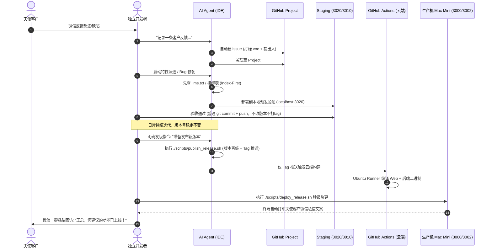

# 独立开发者软件工程方法学白皮书 (Project Studio White Paper)
> **打造可复制、可传承、抗遗忘的单兵工业化研发飞轮**  
> *Author: Jason Xiao & Antigravity (Google DeepMind Agentic Team)*  
> *Version: 1.0.0 (2026 Edition) | Standard: JING-STUDIO.01*

---

## 序言：独立开发者的终极困境与心力衰竭

在现代化软件工程中，全栈开发门槛大幅降低，AI 编码助手（如 Cursor、Antigravity、Claude Code）使得独立黑客（Indie Hacker / Solo Founder）单人构建并发布复杂 SaaS 与多端系统成为可能。

然而，当项目跨越 **6 个月、12 个月乃至数年长程演进**，或者开发者同时维护 **2 个以上并行软件工程** 时，绝大多数独立开发者都会坠入以下四大“心力衰竭深渊”：

1. **长程失忆陷阱 (Long-Horizon Amnesia)**：
   - 依赖时间流水账式的 `TODO.md`，数月后旧任务淹没、新任务堆积。半年后开发者根本记不起“某项业务能力曾经在哪个版本交付过、系统现在到底具备哪些功能”。
2. **天使客户原声黑洞 (The VOC Black Hole)**：
   - 天使种子客户在微信或口头中提出的宝贵建议，随手记下后被无序待办淹没；或者耗费数周研发上线后，开发者在亢奋中直接扑向下一项特性，**彻底忘记给提建议的客户回访同步**，痛失口碑自传播飞轮。
3. **功能腐化与僵尸代码 (Feature Rot & Zombie Code)**：
   - 经历多次架构重构与 UI 改版后，早期开发的数十项子功能可能接口报错或入口被隐藏，变成无人知晓的“脑死亡功能”，技术负债无限膨胀。
4. **AI 上下文爆炸与低效盲搜 (Context Explosion & Blind Grepping)**：
   - 代码规模突破数万行后，缺乏代码语义接缝图谱。AI 每次排查微小 Bug 都不得不进行全仓发散式搜索，几轮对话吃满几十万 Tokens，触发“Lost in the Middle”效应导致模型幻觉。

**Project Studio 的使命，就是将软件研发从“依赖人肉记忆的作坊式劳作”，淬炼为“机器与制度自动运转的单兵工业化飞轮”。**

---

## 第一部分：Project Studio 七大立论基石

```
                           【Project Studio 七大支柱体系】
                                         │
   ┌──────────────────┬──────────────────┼──────────────────┬──────────────────┐
   ▼                  ▼                  ▼                  ▼                  ▼
[1. 中央驾驶舱]    [2. 能力大地图]    [3. 原声闭环飞轮]  [4. 权威端口注册]  [5. 渐进代码图谱]
GitHub Projects    CAPABILITIES.md    VOC 权重与 24h SLA  单机多服务严格分段  llms.txt + 接缝表
跨仓库多项目聚合   含100%冒烟路径     发版自动生成私信   杜绝本地踩踏碰撞   AI 1秒直达拒盲搜
   │                  │                  │                  │                  │
   └──────────────────┴──────────────────┼──────────────────┴──────────────────┘
                      ┌──────────────────┴──────────────────┐
                      ▼                                     ▼
           [6. 宿主注入与物理门禁]               [7. 研发与发版彻底解耦]
           System Prompt + Git Hook             日常仅Commit禁改版本禁推Tag
           代码替人守门 · 违规刚性拦截           发版专属publish流水线触达
```

---

### 基石一：全局统一驾驶舱 (Single Portfolio Cockpit)
- **拒绝孤岛**：个人拥有的所有软件工程（如 P12 随身秘书、字疏·书院等）统一纳管于一个云端中央项目看板：`Jason's Software Studio`（GitHub Project #1）。
- **核心字段契约**：
  - `Project`：标识所属项目（P12 / 字疏书院 / 新项目）；
  - `Module`：所属业务模块枚举（认知减负、随身秘书、GTD核心、古文字库等）；
  - `VOC Reporter`：天使客户来源（如“小荷叶/王磊”、“李总”）；
  - `Stage`：生命周期流转（`VOC Inbox` -> `Backlog` -> `In Progress` -> `Staging Verified` -> `Done`）。

### 基石二：微观单一事实源与能力大地图 (Capability Matrix)
- **铁律**：严禁用随时间沉没的 TODO 流水账代替系统业务全貌。
- 每个项目根目录必须维系一份 `docs/CAPABILITIES.md`。
- **双向锚定原则**：
  1. 按系统核心业务能力支柱（Pillars）归档，记录交付版本；
  2. 每一项能力必须配备 **【冒烟验证路径 (Smoke Path)】**，作为大版本发布或大重构时的端到端冒烟自检清单，彻底根治功能腐化。

### 基石三：天使客户原声双向飞轮 (VOC Lifecycle & Closure SLA)
- **同质聚类加权**：新反馈先查已有 Issue，同质需求追加提议人名单，出现 $\ge 2$ 位客户提及直接升格为 P0；偏门小众需求归档 `label:someday` 冷冻桶。
- **发布即回访 SLA**：发版部署成功后，系统自动提取闭环的客户名单，在终端输出带有客户尊称的现成微信通知模板，开发者 20 秒完成微信回访。

### 基石四：权威端口分配与运行态物理隔离 (Port Registry)
多项目在同一物理机（MacBook Air / Mac Mini）并行时，必须依据统一注册表严格分段，严禁随意抢占：
- **`3000 ~ 3009`**：生产对外服务端口（P12: 3000, P12国学: 3001, 书院: 3002）；
- **`3010 ~ 3019`**：伴生测试与预发端口（书院Staging: 3010）；
- **`3020 ~ 3029`**：核心应用预发 Staging 端口（P12 GTD: 3020, P12国学: 3021）；
- **`3080`**：公共前端与脚手架管理服务；
- **`8440 ~ 8449`**：特殊移动网络高位中转（书院移动端 SSL: 8445）；
- **数据库隔离**：各项目 SQLite 严格存放在私有目录，禁止跨项目软链。

### 基石五：AI 渐进式代码图谱与防爆 Context 索引 (Progressive Code Graph)
- **拒绝盲搜**：在项目根目录设立 `llms.txt` 与 `docs/ARCHITECTURE_SEAMS.json`。
- **端到端接缝链条**：建立 `UI Widget -> Provider Store -> API Route -> Storage SQL -> DB Table` 拓扑。
- **探针工具**：通过 `code_query.sh` 定向提取接缝，AI 查询仅消耗 < 500 Token，将全仓排查效率提升 100 倍。
- **物理随动更新**：通过 Git Pre-commit 钩子增量重算，代码提交即更新，知识库永不过时。

### 基石六：宿主底层强注入与物理脚本门禁 (Deterministic Enforcement)
- **System Prompt 锁死**：规则写入 `AGENTS.md` 与 `GEMINI.md`，由 IDE 底座在每次会话强制注入顶层；
- **代码替 AI 守门**：把客户回访工具直接嵌入部署流程末尾，必定打印回访清单；Git Hook 刚性阻断无 Issue 编号的提交。

### 基石七：研发与发版彻底解耦飞轮 (Dev-Release Decoupling & Cloud-Native Gate)
- **日常研发态 (Dev & Staging)**：
  - 改 Bug、做小需求、日常优化仅做普通 Git Commit（必须携带 `#<Issue_ID>`）；
  - **严禁擅自修改 `pubspec.yaml`、`Cargo.toml` 等版本源文件自增版本号**；
  - **严禁创建 Git Tag，严禁推 Tag**；
  - 本地验证一律限定在预发 Staging 端口（如 `:3020` 或 `:3010`），`git push` 零本地编译负担、零云端打包触发，确保云端资源零浪费。
- **正式发版态 (Production Release)**：
  - **单点发版授权**：仅当用户明确发出发版上线指令时，才调用专属发版脚本 `./scripts/publish_release.sh [patch|minor|major]`；
  - 自动递增版本事实源、打上 Git Release Tag 并推送到 GitHub，触发 GitHub Actions 编译 Web 与后端制品；
  - 生产机执行 `./scripts/deploy_release.sh` 秒级拉取热更上线，达成发版过程的绝对确定性与零环境漂移。

---

## 第二部分：三级渐进式代码知识库架构实战

为了杜绝代码膨胀带来的 AI 上下文爆炸，系统采用 **L0 ~ L2 三级渐进式检索模型**：

```
                    【L0: 极速路由入口 (llms.txt)】
                    AI 进项目 1 秒建立全景心智模型 (Token < 300)
                                 │
                                 ▼
              【L1: 端到端业务接缝 (ARCHITECTURE_SEAMS.json)】
              精准映射 UI -> API -> Route -> Table 全链路 (Token < 800)
                                 │
                                 ▼
                 【L2: 定向代码探针 (code_query.sh)】
                 针对具体接口或特性，毫秒级提取 10 行目标核心代码
```

### 1. 随动自动更新机制 (Zero-Manual-Effort)
在 `.git/hooks/pre-commit` 中配置自动拦截：
```bash
# 每次 git commit 时自动触发增量提取
./scripts/auto_sync_code_index.sh
git add llms.txt docs/ARCHITECTURE_SEAMS.json 2>/dev/null || true
```
代码提交的同时，知识库完成了物理级原子刷新，**保证知识库永远与当前 commit 完全同频**。

---

## 第三部分：日常研发标准作业流 (Standard SOP)



---

## 第四部分：新项目 10 秒极速起航指南 (Quick Start)

任何新成员、新项目或新设备，只需三步即可无缝继承整套工业化飞轮：

### 步骤 1：拉取中央大脑与全局技能
```bash
git clone https://github.com/JasonCry/my-ai-brain.git ~/Projects/my-ai-brain
# 挂载技能至全局配置
ln -sfn ~/Projects/my-ai-brain/skills/project-studio ~/.gemini/config/skills/project-studio
```

### 步骤 2：进入任何新仓库并一键初始化
```bash
cd ~/Projects/your-new-app
~/.gemini/config/skills/project-studio/scripts/init_project_studio.sh
```
*自动完成：云端 Project #1 挂接、能力大地图生成、端口表注入、回访工具部署、AI 跨端铁律注入。*

### 步骤 3：起航编码
对 AI 说：*“我们要开发第一个核心特性，请按 SOP 推进并在能力大地图追加登记。”*  
**全套体系自动像导航仪一样为你守护到底！**
